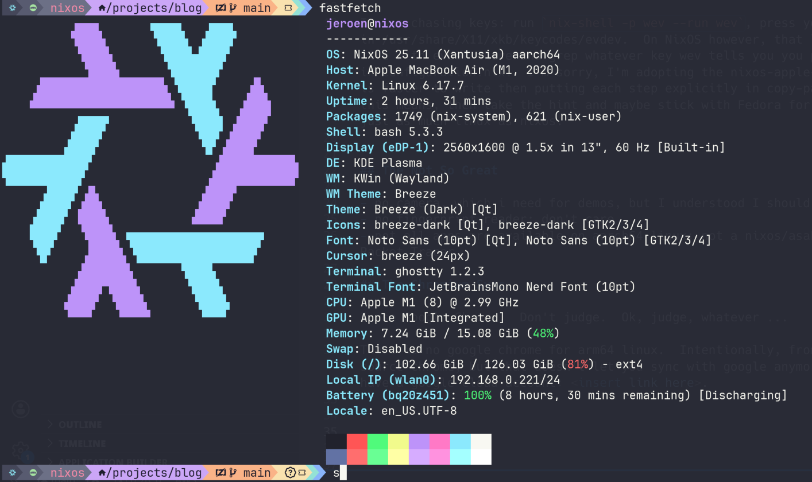

# Asahi NixOS on Mac Silicon

## Introduction

Getting this to work, hut a lot.  There's a lot of friction and yak shaving.  If you want to do this, maybe start with an LFS or Gentoo (the manual way) in a VM so you're comfortable with this kind of stuff.

We're going to handle different boot stages, create filesystems, mount and chroot, copy over, troubleshoot a lot, compile kernel, ..

All worth it though ...  (for now)

## The Good

HABEMUS ASAHI NIXOS!

There's [documentation](https://github.com/nix-community/nixos-apple-silicon/blob/main/docs/uefi-standalone.md).  Read it well.  Top to bottom, left to right, and again.

Weird keymapping issues for belgian keyboards (check my [configuration.nix](configuration.nix)).

It was chasing keys: run `nix-shell -p wev --run wev`, press your key, see what key does what, look it up in /usr/share/X11/xkb/keycodes/evdev.  On NixOS however, that lives in the nix store, so search for a file with evdev there and grep whatever key wev tells you you pressed, and map that to whatever you want in configuration.nix.  I'm sorry, I'm adopting the nixos-apple-silicon documentation style.  This style is faster to write then putting each step explicitly in copy-pasta blocks, and if you don't know what this means, then take the hint and maybe stick with Fedora for now.  Nothing wrong with Fedora btw, it's just as much linux as nixos.

## The Not So Great

- no camera, which i need for demos, but I understood I should be able to use an external camera.
- no fingerprint reader: don't care
- not all apps are available on aarch64 linux: not a nixos/asahi/silicon thing, but arm64 specific. Ie. Packet Tracer.  

## The Absolute Bad

Don't do the in-place install where you already have a working Asahi Fedora.  Delete the partitions (__carefully!!__, or you know, not) and start from the excellent asahi installer script.  This is the so-called LUSTRATE installation.  Here's [the doc](https://nixos.org/manual/nixos/stable/#sec-installing-from-other-distro) if you can't control yourself.  Just don't do it.

Also, you may have to use several different usb thumbdrives, as some work better than others.  USB in the U-Boot is quirky.

## The TLDR; Procedure
The clean installation procedure works fine:

- if not installing the default Fedora, prepare your usb drive (NixOS [here](https://github.com/nix-community/nixos-apple-silicon/blob/main/docs/uefi-standalone.md)). 
- (delete existing asahi installation using diskutil, carefully, if you already have one)
- run the excellent installer script from macos
- follow instructions through the installer, READ ALL MESSAGES AT LEAST A LOT
- let it shutdown
- press the power button until it says it's starting boot options ..
- choose asahi
- follow some more prompts
- ....

## Indirectly Related

### Chromium Sync

I use Google Chrome.  Don't judge.  Ok, judge, whatever ...

There is no google chrome for arm64 linux.  Intentionally, from what I read.  There's chromium, the open source chrome, but that doesn't let you sync with google anymore.  Ok, there's [this workaround](https://blog.jeroenflvr.dev/blog/chromium-google-sync/), if you have a google cloud account.

